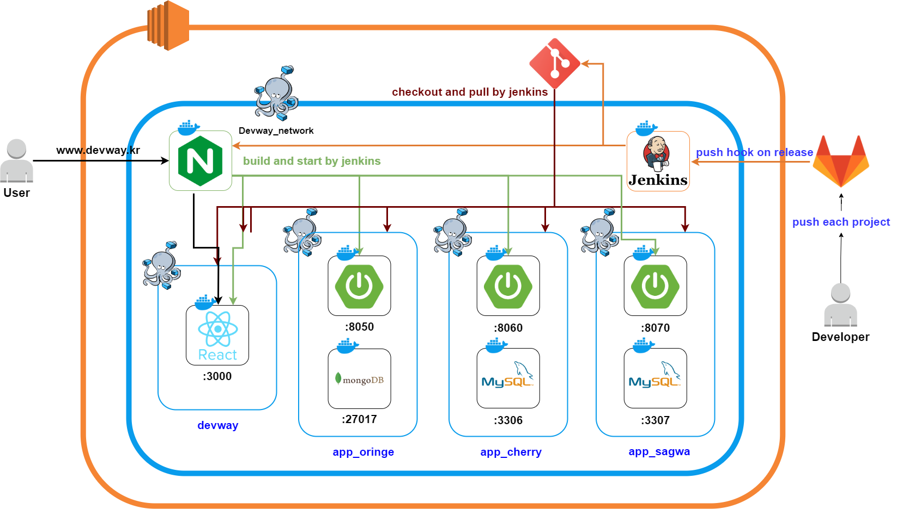

# 오린지 (oringe) - 나만의 챌린지 기록/인증 서비스

## ✨ 앱 소개

챌린지를 만들고, 필요한 인증 방식을 직접 선택하여 작은 도전 부터, 큰 도전까지 나만의 챌린지를 관리하는 서비스 입니다.

## 💡 주요 기능

| 기능 | 내용 |
| :--------------------------------------------------- | :--------------------------------------------------------------------------------------------|
| 챌린지 생성 | 원하는 챌린지의 제목과 기간을 정하고, 원하는 인증 방식을 설정합니다.|
| 인증 생성 | 생성한 챌린지의 기간에 설정한 인증 방식에 맞추어 기록을 작성합니다. |
| 챌린지 확인 | 생성한 챌린지를 메인화면에서 확인 가능합니다. |
| 인증 확인 | 챌린지의 캘린더 기록을 통해 인증 기록을 확인합니다. |

# 기능 상세 소개

<h3>챌린지 생성</h3>

<h3>챌린지 확인</h3>

<h3>인증 생성</h3>

<h3>인증 확인</h3>

<h3>워치 연동</h3>

 

## ⚙ 기술 스택

<h3>Mobile</h3>

<h3>Backend</h3>

<h3>Devops</h3>

## 🎈 개발자 소개

<table>
    <tr>
        <td height="140px" align="center"> 
               김동학  (Full-Stack) </a>  </td>
        <td height="140px" align="center"> 
               박소현  (Full-Stack) </a>  </td>
        <td height="140px" align="center"> 
               양성주  (Full-Stack) </a>  </td>
        <td height="140px" align="center"> 
               김준섭  (Full-Stack)   (devops) </a>  </td>
    <tr>
        <td align="center">Spring-boot Android-native with Java </td>
        <td align="center">Spring-boot Android-native with Java </td>
        <td align="center">Spring-boot Android-native with Java </td>
        <td align="center">Spring-boot Android-native/wearOS with Java Nginx Docker Jenkins </td>    
    </tr>
</table>

# 🛠 시스템 흐름도

